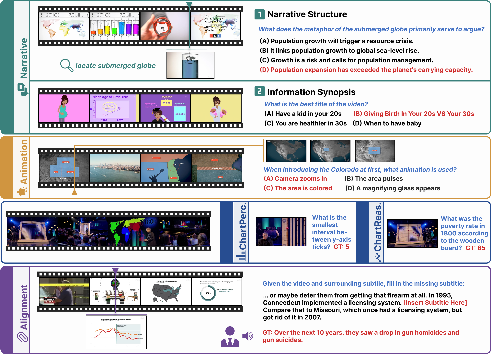
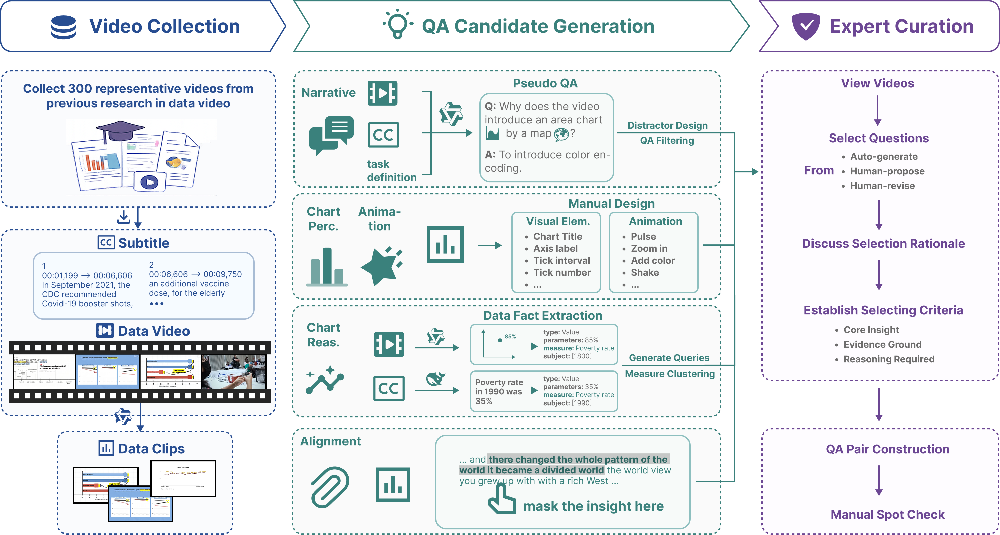
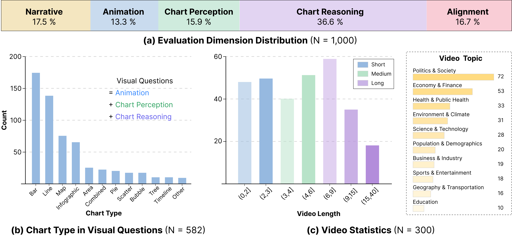
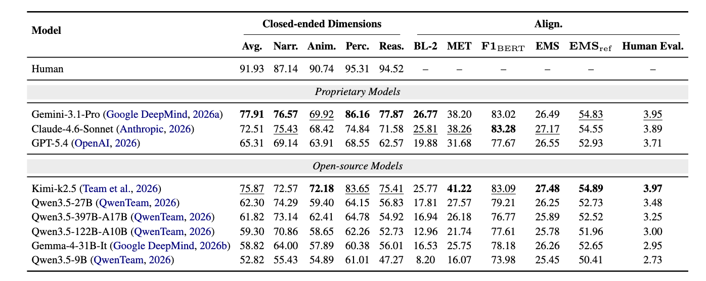

# DVBench: Benchmarking MLLMs for Understanding Dynamic Charts and Narratives in Data Videos

[](#main-results)
[](LICENSE)
[](DATA_LICENSE.md)

## 📝 Abstract

While MLLMs have made significant strides in chart comprehension and video understanding, current evaluations largely isolate these capabilities, leaving a critical gap in understanding temporally evolving structured visual information. To address this gap, we introduce **DVBench**, a benchmark for evaluating MLLMs on data videos, a storytelling medium that integrates dynamic charts with structured narratives. We decompose data video understanding into five dimensions. DVBench comprises 300 real-world data videos and 1,000 human-verified QA pairs curated through a rigorous semi-automated pipeline. Extensive evaluations of nine MLLMs show that Gemini-3.1-Pro achieves the best overall performance, while Kimi-k2.5 is the strongest open-source model. We further identify two notable phenomena: open-source model performance does not scale strictly with parameter size, and narrative proficiency does not guarantee visual capability. Fine-grained analyses and ablation studies further reveal dimension-specific weaknesses and the effects of frame configurations and subtitle inputs, informing future MLLM development.



## 🔍 Overview

### 🏗️ Benchmark Construction



The benchmark construction consists of three main stages: (1) video collection, (2) QA candidate generation, and (3) expert curation. Dimension-specific strategies are used to generate candidates for Narrative, Chart Perception, Animation, Chart Reasoning, and Alignment, followed by expert curation and verification.

### 📊 Dataset Statistics



The dataset statistics show (a) the distribution of questions across the five evaluation dimensions, (b) the chart-type distribution of visual questions and its dimension-specific breakdown, and (c) the video-length and topic distributions of the collected data videos. Visual questions include Animation, Chart Perception, and Chart Reasoning.

## 🏆 Main Results



## 🚀 Quick Start

Create an isolated environment and install DVBench:

```bash
python -m venv .venv
source .venv/bin/activate
python -m pip install -e ".[eval,providers]"
```

Place videos in `data/videos/<video_id>.mp4`.

Set the API key for the provider you want to run:

```bash
export GEMINI_API_KEY=...
export OPENAI_API_KEY=...
export ANTHROPIC_API_KEY=...
export KIMI_API_KEY=...
```

Run inference with one of the four API-backed models from the paper:

```bash
dvbench-infer \
  --provider gemini \
  --data data/DVBench_QA.jsonl \
  --videos-dir data/videos \
  --output predictions.jsonl
```
Evaluate the generated predictions:
```bash
dvbench-evaluate predictions.jsonl \
  --data data/DVBench_QA.jsonl \
  --output dvbench_results.json \
  --prompt-seed 0
```

## ✒️ Citation

If you find our work helpful for your research, please consider citing our work.

```bibtex
@inproceedings{wang2026dvbench,
  title={DVBench: Benchmarking MLLMs for Understanding Dynamic Charts and Narratives in Data Videos},
  author={Wang, Bomiao and Shao, Zekai and Lan, Jiexiang and Fu, Xiaoliang and Zeng, Xingchen and Chen, Siming},
  booktitle={Findings of the Association for Computational Linguistics: EMNLP 2026},
  year={2026}
}
```
